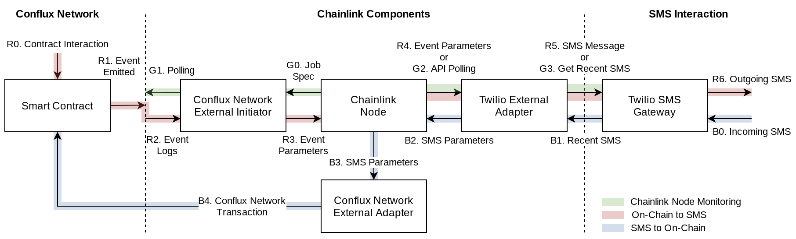
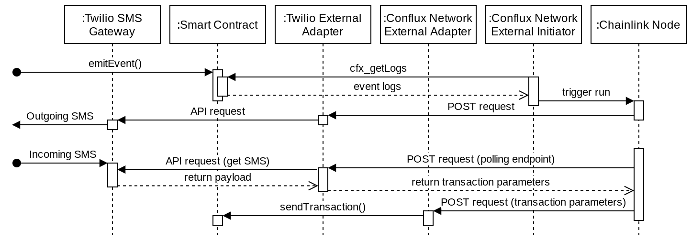

# Conflux Network + Chainlink: SMS Connection Demo

Demonstrating how to connect Conflux Network and Chainlink together, and thus bringing the world of oracles to Conflux Network. This is a simple demonstration of how to use an [external initiator](https://github.com/smartcontractkit/chainlink/wiki/External-Initiators) (EI) and [external adapter](https://github.com/smartcontractkit/chainlink/wiki/External-Adapters) (EA) that allows for an external SMS Gateway API to interact with a simple on-chain smart contract.

There are two main implications:

1. The connection of Chainlink to Conflux Network allows for the growth of all types of oracles on Conflux Network to power exchanges, other oracle needs, and bridge Web2 technology with Web3.
1. The specific implementation of using SMS to interact with the blockchain has the potential for opening access to Web3 for users without good internet connection in areas across the world. Or simply, text-based interactions with smart contracts for simplicity and convenience.

### Diagrams
Demonstration diagrams for the various connections and the interaction sequences to connect a Conflux Network smart contract to an SMS gateway using Chainlink.





## Setup Steps

Generalized setup steps for the configuration of Chainlink components - more details are provided for connecting the various pieces together. Please see [Chainlink](https://docs.chain.link/docs)/[Conflux](https://developer.conflux-chain.org/) documentation if more details on configuration and setup are needed.

Before configuring the Chainlink components, there needs to be an oracle contract on the Conflux Network that emits events. This is needed for the EI to trigger job runs on the Chainlink node. See the [contractInteraction](./contractInteraction) folder for code to interact with the Conflux Network.

### Running a Chainlink Node

This step involves running a Chainlink node from a docker container as specified in the [developer documentation](https://docs.chain.link/docs/running-a-chainlink-node). Below is a sample `.env` file that should be included in the `\.chainlink*` folder.  
_Note: An ETH client URL is not required_

```
ROOT=/chainlink
LOG_LEVEL=debug
ETH_CHAIN_ID=3
MIN_OUTGOING_CONFIRMATIONS=2
LINK_CONTRACT_ADDRESS=0x20fe562d797a42dcb3399062ae9546cd06f63280
CHAINLINK_TLS_PORT=0
SECURE_COOKIES=false
ALLOW_ORIGINS=*
DATABASE_TIMEOUT=0
DATABASE_URL=postgresql://$USERNAME:$PASSWORD@$SERVER:$PORT/$DATABASE
ETH_DISABLED=true
FEATURE_EXTERNAL_INITIATORS=true
CHAINLINK_DEV=true
```

Then the following command is run (_note: may be different depending on folder configuration_)

```
cd ~/.chainlink-ropsten && docker run -p 6688:6688 -v ~/.chainlink-ropsten:/chainlink -it --env-file=.env smartcontract/chainlink local n
```

During setup, a node password and a username/password is required for setup. The node password is used each time the node is started. The username/password is used for accessing the node UI at `http://localhost:6688` and for other parts of setup.

### Setting Up an External Initiator

External initiators observe a blockchain node endpoint and will trigger runs on the Chainlink node.  
_Note: Prerequisite for Go to be installed. See [here](https://golang.org/doc/install) for instructions._

Clone and build the [external initiator repository](https://github.com/Conflux-Network-Global/external-initiator) (forked from main repository to adapt for Conflux Network)

```
git clone https://github.com/Conflux-Network-Global/external-initiator
cd external-initiator
git checkout generalized-EI
go build
```

Create a `.env` file in the `external-initiator` folder with the following contents:

```
EI_DATABASEURL=postgresql://$USERNAME:$PASSWORD@$SERVER:$PORT/$DATABASE
EI_CHAINLINKURL=http://localhost:6688
EI_IC_ACCESSKEY=<INSERT KEY>
EI_IC_SECRET=<INSERT KEY>
EI_CI_ACCESSKEY=<INSERT KEY>
EI_CI_SECRET=<INSERT KEY>
```

_Note: the database URL should be separate from the Chainlink node database_

The 4 keys in the `external-initiator/.env` file are generated by the Chainlink node with the following process. [Link](https://docs.chain.link/docs/miscellaneous) to more Chainlink/Docker documentation.

1. Use `docker ps` and obtain the container ID for the Chainlink node. To access the command line within the container, use `docker exec -it <containerID> /bin/bash`.
1. Once inside the container, log in using `chainlink admin login` and the username/password from when the container is created.
1. To create the keys, `chainlink initiators create <NAME> <URL>`. Note that in this case the name is `cfx` and the url is `http://172.17.0.1:8080/jobs` to access the locally run external-initiator using the docker container gateway. (otherwise, they are on two different networks). The 4 keys are generated in the same order as listed above.

The external initiator can be started up using:

```
./external-initiator "{\"name\":\"cfx-mainnet\",\"type\":\"conflux\",\"url\":\"http://mainnet-jsonrpc.conflux-chain.org:12537\"}" --chainlinkurl "http://localhost:6688/"
```

Where the url can be changed to the respective endpoint. In this case, it is pointed at the public Conflux Network testnet endpoint. For reliability purposes, do not use this in production; it is much more reliable to connect to a non-public endpoint.

### Creating a Bridge for an External Adapter

Two simple external adapters are provided in the [CFX_externalAdapter](./CFX_externalAdapter) and [SMS_externalAdapter](./SMS_externalAdapter) folders. They are simple servers built using Express that receives a post API call from the Chainlink node and sends the information to the smart contract on Conflux Network or to the SMS Gateway API (Twilio).

Both requires a `.env` file in the respective folders that contain:  
For `CFX_externalAdapter`:

```
PRIVATE_KEY=<ACCOUNT PRIVATE KEY>
```

The private key is the private key to an address that allows the external adapter to send transactions to Conflux Network.

For `SMS_externalAdapter`:

```
TWILIO_ACCOUNT_SID=<TWILIO SID>
TWILIO_AUTH_TOKEN=<TWILIO TOKEN>
OUTGOING_NUMBER=<PERSONAL NUMBER>
TWILIO_NUMBER=<TWILIO NUMBER>
```

The SID and token are for Twilio's API access, and the phone numbers are for interacting with the API and must include the international code as well (for example: `16160001111`).

Don't forget to install packages with `yarn` and then start the servers with `yarn start`. The external servers will start on `http://localhost:5001` for the `CFX_externalAdapter` and on `http://localhost:5000` for the `SMS_externalAdapter`. Additionally, the bridges should be created using `http://172.17.0.1` to access the local network from the containerized Chainlink node.

In order to connect the two external adapters, three bridges were used.

| Bridge Name    | Endpoint                     | Functionality                          |
| -------------- | ---------------------------- | -------------------------------------- |
| `TwilioBridge` | http://172.17.0.1:5000       | Sending On-Chain event to SMS gateway  |
| `TwilioCheck`  | http://172.17.0.1:5000/check | Checking SMS gateway for new messages  |
| `cfxSendTx`    | http://172.17.0.1:5001       | Sending transaction to Conflux Network |

### Connecting Everything Together

In order to create the necessary connections between the various components (Conflux Network, Chainlink node, EI, EA, and Twilio API), two job runs on the node need to be created. This can be done by accessing the node via the `localhost:6688` address and logging in.

The first job spec is for connecting the external initiator and can be found [here](./jobSpecs/externalInitiator.json).

```
{
  "initiators": [
    {
      "type": "external",
      "params": {
        "name": "cfx",
        "body": {
          "endpoint": "cfx-mainnet",
          "addresses": ["0x8250e53e596dddd6a167a3e6279bfd5ca85115bb"]
        }
      }
    }
  ],
  "tasks": [
    {"type": "TwilioBridge"}
  ]
}

```
The `name` in the initiator portion is the same name as entered when using the `chainlink initiators create <NAME> <URL>` command. The `endpoint` is the same name used in the external initiator startup command. The `addresses` are the contract addresses on Conflux Network. When this job is first created, it will trigger a test payload in the EI that is sent to Conflux Network. The test payload contains a `cfx_epochNumber`, and upon successful return to the node, the EI begins polling the Conflux Network endpoint periodically (~5 seconds). When it catches an event using `cfx_getLogs`, it sends information to the `TwilioBridge` external adapter via the Chainlink node.

The [second job spec](./jobSpecs/twilioCheck.json) is for checking when new SMS messages arrive and send those as transactions to the smart contract.
```
{
  "initiators": [
    {
      "type": "cron",
      "params": {
        "schedule": "CRON_TZ=UTC */30 * * * * *"
      }
    }
  ],
  "tasks": [{ "type": "TwilioCheck" }, { "type": "cfxSendTx" }]
}
```
This is achieved by using a CRON job where the Chainlink node will ask the SMS adapter to check the endpoint and any new messages are passed on to the CFX adapter to send to the chain.

### Notes

- This is a demonstration integration, there are many improvements that can be made from a increased security, code optimization, and testing perspectives
- To do: test cases for CFX EI
